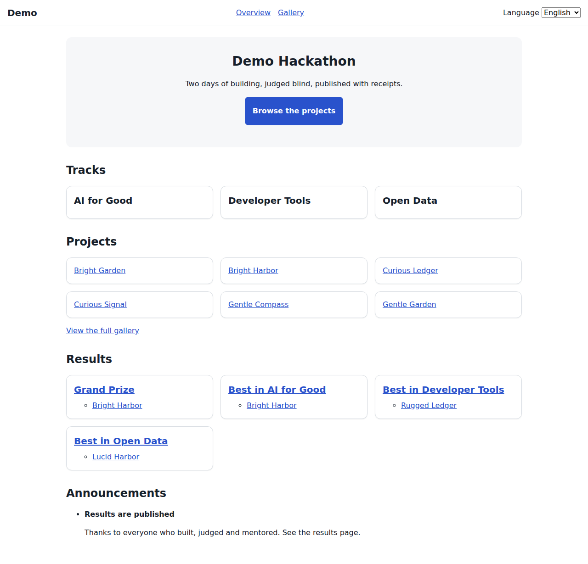
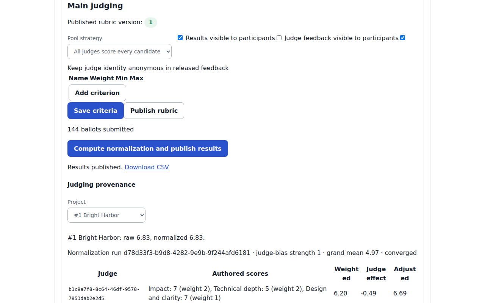
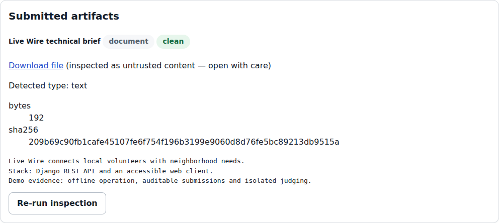
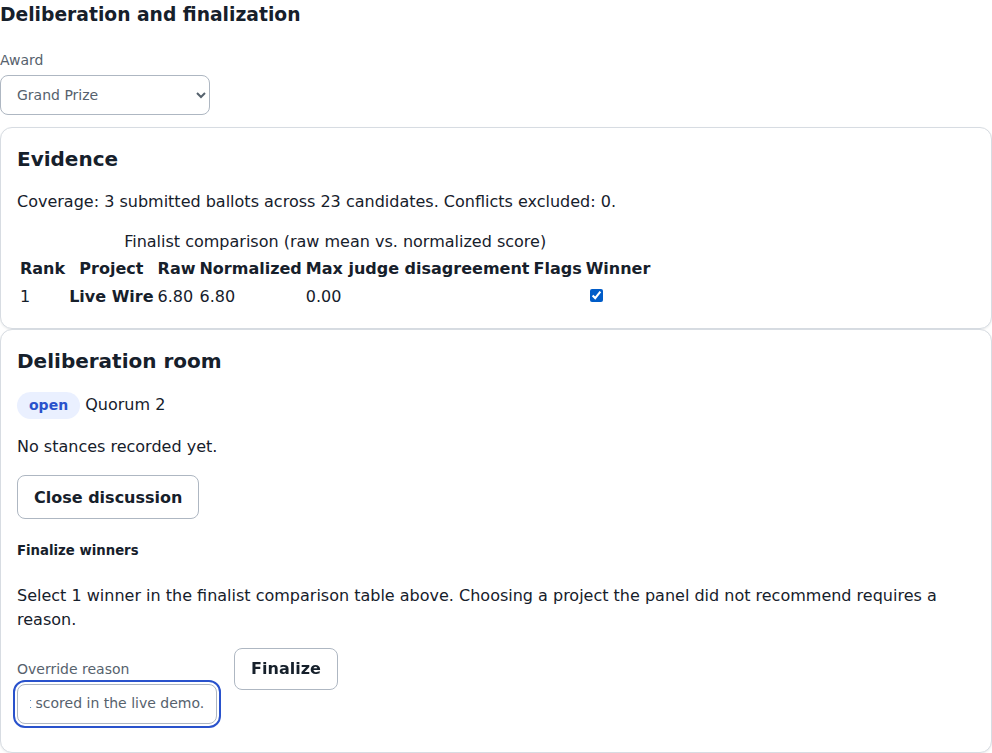

# Conflux

Modern, self-hostable hackathon operations and judging.



Run the complete staged lifecycle: registration, teams, submissions,
eligibility review, judging, deliberation, awards and public results.
Organizers, judges and participants work in dedicated browser workspaces,
backed by the same REST API. One-command Compose deployment includes Django,
React, PostgreSQL, Valkey, RustFS and Caddy, with offline operation after build.

- **Judging you can explain:** configurable weighted rubrics, backend-enforced
  judge isolation, connectivity-aware assignment, documented cross-judge
  normalization and Bradley–Terry pairwise ranking. Both judging modes feed
  awards, with frozen evidence, deterministic replay and audit capsules.
- **Events beyond the score sheet:** community voting with duplicate controls,
  throttling and moderation; hybrid/in-person check-in, expo placement,
  walking routes, agenda, mentor support and signed participation records.
- **Portable and API-first:** OpenAPI, generated SDKs, CLI and MCP; canonical
  import/export, declarative Event-as-Code, signed archives and backup/restore.







## Verification

Conflux claims **T1–T4**. The organizer-supplied acceptance checker contains
automated assertions for **T1/T2 only**; **T3/T4 are evaluated manually**.
The [untouched official checker receipt](acceptance-report.txt) verifies T1/T2,
7/7 checks. Its “claimed but not verified: T3 T4” note reflects the absence
of those automated assertions. Conflux's separate
[extended verifier](docs/verification/dogfood-extended.txt) supplies reproducible
T3/T4 and advanced-capability evidence: `make verify-dogfood-extended`.

- Fast gate: **1373 backend tests passed**, 23 skipped; **137 web + 8 embed**
  tests, format/lint/build, OpenAPI and SDK consistency clean.
- Current PostgreSQL and Playwright results: [final targeted pass](docs/verification/final-pass/report.md).
- Prior release receipts: **Dex OIDC 18/18**; cold/offline Compose startup,
  backup/restore, chaos and artifact portability pass; load **149.6 req/s**
  with **zero 5xx or race violations**, integrity checks passing.
  [PVS-H06 evidence](docs/verification/PVS-H06/report.md).

[Known limitations and evidence scope](docs/verification/README.md#remaining-limits) ·
[Judging model and assumptions](JUDGING.md) · [Security model](SECURITY.md)

## Run locally

Install Docker with Compose, then run:

```sh
cp .env.example .env
# Set unique secrets and database/object-store passwords in .env.
make up
```

Open `http://localhost:8080/app/` (or the `CONFLUX_PORT` in `.env`). Check
`http://localhost:8080/api/v1/health/` if startup is still in progress.
Compose builds the app image and applies database migrations at startup;
`make down` stops the stack without deleting its volumes. See
[upgrade and backup instructions](docs/operations/UPGRADES.md) before changing
an installation with real data.

Create an operator with `docker compose exec app python manage.py
createsuperuser`, then use `POST /api/v1/accounts/login/` with its username
and password to obtain a session cookie. Authenticated users can create a
workspace with `POST /api/v1/workspaces/`; the creator becomes its organizer.
The [API guide](docs/api/README.md) and [OpenAPI schema](docs/api/openapi.yaml)
cover the remaining routes. The browser workspace app is served at
`http://localhost:8080/app/` (`/` redirects there) with a sign-in form; sign in
with an account created by `createsuperuser`/the API, or enable optional
OpenID Connect ([SSO](docs/operations/SSO.md)). Password sign-in always works
offline.

For a disposable demo, run `make demo-reset && make demo-e2e` after startup.
The [demo runbook](docs/operations/DEMO.md) covers submitted and published
checkpoints, accounts, scenes and raw video assets. `make seed` imports the
official acceptance fixture and test identities; use it only in a test installation.

## Development

Requirements: Python 3.12, uv 0.12, Node 24, pnpm 12.

```sh
uv sync --frozen
pnpm install --frozen-lockfile
make verify-fast
```

`make verify` is the full local release check. `make format`, `make lint`,
`make test`, and `make build` expose the individual checks. The API entry
point is `src/api/manage.py`; the web app is `src/web`.
Non-Compose local checks use an isolated SQLite database; `DATABASE_URL` (set
by Compose) switches to PostgreSQL. Running the API directly requires
`DJANGO_SECRET_KEY` in the environment; the Makefile supplies a disposable
value for local checks only.

### Stack commands

```sh
make up      # clean, offline build — full image rebuild, authoritative
make dev     # fast iteration — bind-mounted source, Django auto-reloads,
             #   frontend via Vite dev server/HMR (http://localhost:5173)
make logs
make down    # or `make dev-down` for the dev overlay
make seed    # deterministic acceptance identities
```

Use `make dev` for day-to-day edits: it only rebuilds the image if one doesn't
exist yet. Run `make dev-build` after changing a Dockerfile or a
dependency/lockfile. `make up` always rebuilds and remains the authoritative
clean-build path for release verification.

## Feature guides

Operational guides for the post-core capabilities live in `docs/operations/`:
[governance](docs/operations/GOVERNANCE.md), [SSO](docs/operations/SSO.md),
[MCP adapter](docs/operations/MCP.md), [portfolio](docs/operations/PORTFOLIO.md),
[continuation](docs/operations/CONTINUATION.md),
[event logistics](docs/operations/EVENT_LOGISTICS.md),
[conveniences](docs/operations/CONVENIENCE.md),
[capacity and load testing](docs/operations/CAPACITY.md) and
[browser journeys](docs/operations/E2E.md),
[PVS in the UI](docs/operations/PVS_UI.md) and
[final demo runbook](docs/operations/DEMO.md).
